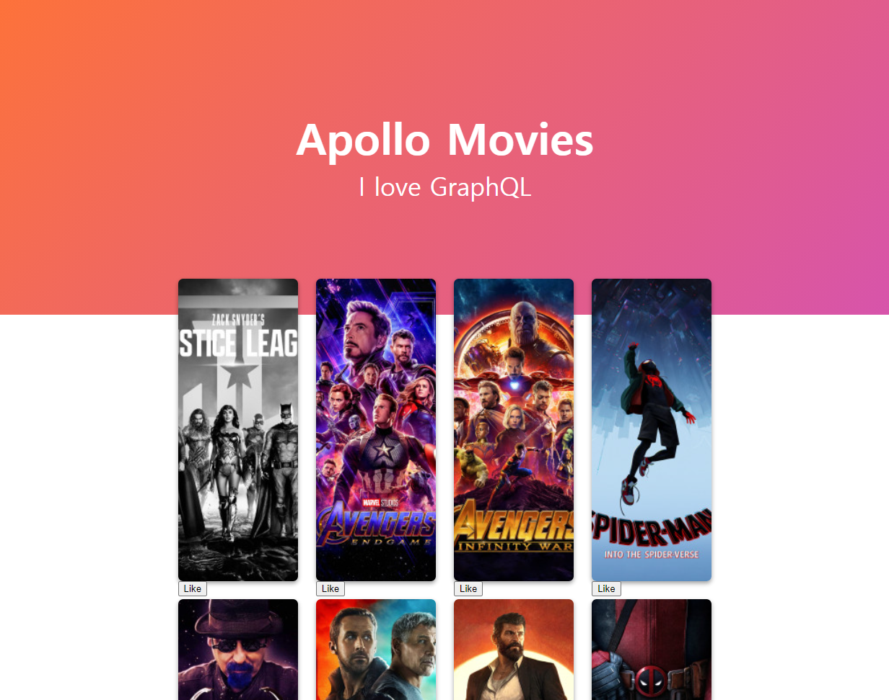

사용 방법
===
서버 준비하기
---
https://github.com/basalcode/movieql<br />
위의 주소로 들어가 설치 방법에 따라 설치 후 서버를 실행한다.<br />

다운로드 및 패키지 설치
---
* ### 다운로드
```PowerShell
git clone https://github.com/basalcode/apollo-2021.git
```
* ### 패키지 설치
```PowerShell
npm install

또는

yarn
```
시작하기
---
```PowerShell
npm run start

또는

yarn start
```
localhost:3000으로 실행합니다.<br />
<br />
다음과 같은 화면이 나오면 성공!<br />
<br />

> 참조 링크: https://nomadcoders.co/react-graphql-for-beginners/lobby<br />